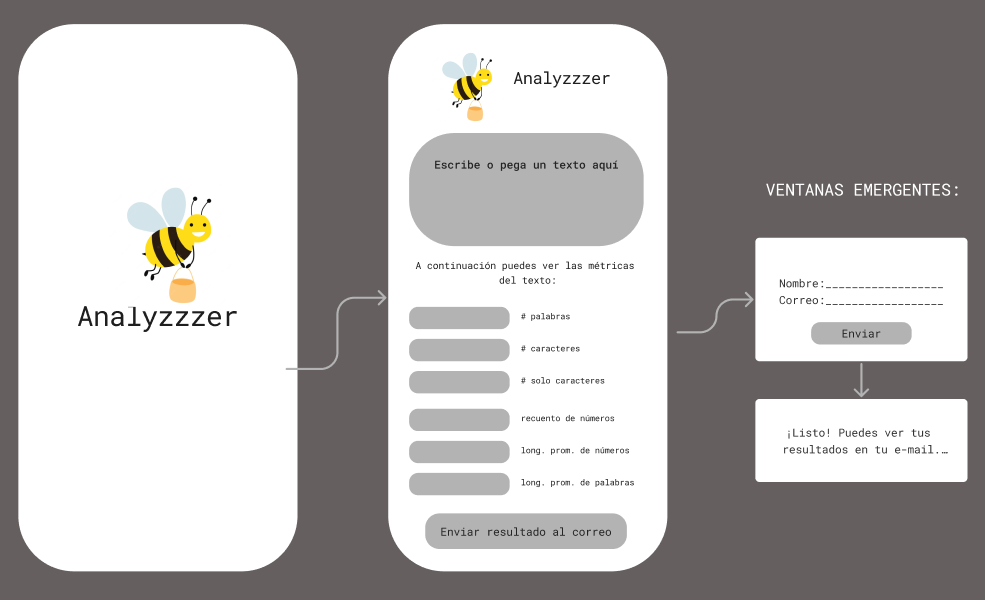
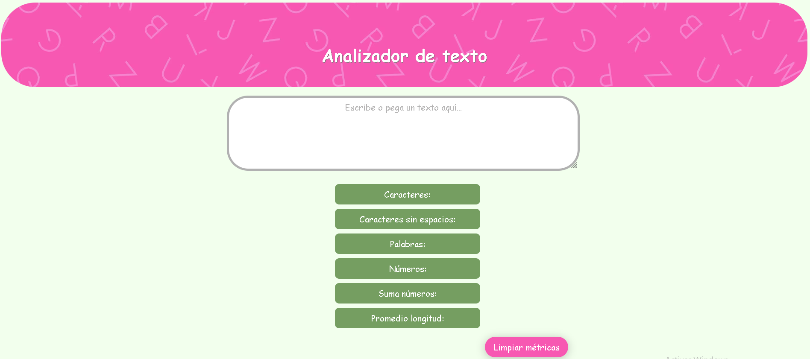

# Analizador de texto

## Índice

* [1. Consideraciones generales](#1-consideraciones-generales)
* [2. Prototipo](#2-prototipo)
* [3. Funcionalidades](#3-funcionalidades)
* [4. Sobre el boilerplate](#4-sobre-el-boilerplate)
* [5. Criterios de aceptación mínimos del proyecto](#5-criterios-de-aceptación-mínimos-del-proyecto)
* [6. Pruebas](#6-pruebas)
* [7. Entregable](#7-entregable)

***

## 1. Consideraciones generales

* Este proyecto lo he resuelto de manera **individual**, aunque definitivamente necesité de otras personas, compañeras y coachs.
* El rango de tiempo estimado para completar el proyecto era de 1 a 3 Sprints y a mi me tomó 2 Sprints y medio, el medio fue el README, más por procrastinar que por verdadera dificultad.
* Mantuve la premisa de enfocarme en aprender y no solamente en "completar" el proyecto, me costó.
* Considero que este proyecto sigue en proceso. Es evidente al ver el resultado final con respecto a mi prototipo inicial.

## 2. Prototipo

_Credito: Imagen de Oli. En la imagen se muestra el prototipo inicial.

Mi analizador de texto es una aplicación para extraer información útil de un
texto utilizando diversas funciones de lógica sencilla matemática.
Proporciona una variedad de métricas que brindan información básica sobre la 
longitud y la estructura del texto como por ejemplo, el conteo de palabras y 
el conteo de caracteres. 

En general, brinda información valiosa, que pueden ayudar a las usuarias a sacar 
conclusiones sobre aspectos que quiera conocer en algún escrito.
Por ejemplo: si mi usuaria estuviera por presentar un ensayo, que tiene un límite
de palabras o caracteres, podría simplemente verificar esa longitud con esta aplicación.

## 3. Funcionalidades

En resumen este proyecto es un analizador de texto web para calcular
y mostrar métricas de un texto enviado por el usuario.

El listado de funcionalidades es el siguiente:

1. Permite a la usuaria ingresar un texto escribiéndolo o pegándolo en un cuadro de texto.

2. La aplicación calcula las siguientes métricas actualizando el
resultado en tiempo real:

    - **Recuento de palabras**
    - **Recuento de caracteres**
    - **Recuento de caracteres excluyendo espacios y signos de puntuación**
    - **Recuento de números**
    - **Suma total de números**
    - **Longitud media de las palabras**

3. Además permite limpiar el contenido de la caja de texto haciendo
clic en un botón.

## 4. Sobre el boilerplate

La lógica del proyecto está implementada completamente en JavaScript puro
también conocido como Vanilla JavaScript.

Para comenzar este proyecto hice un _fork_ y _cloné_ el repositorio que contenía 
un _boilerplate_ con tests (pruebas) en la cuenta github de **Laboratoria**. 
Aprendí que un _boilerplate_ es la estructura básica de un proyecto que sirve 
como un punto de partida con archivos y configuración inicial de dependencias y tests.

Me impresionó que este proceso fuera tan sencillo, en sí mismo. Forkear básicamente
es un click, clonar no fue muy difícil, la dificultad estuvo en sincronizar mi equipo
con el github.

### Sobre scripts / archivos que me facilitó Laboratoria

Para mi estos fueron los más retadores:
* `README.md`: ya tenía la información necesaria para desarrollar la aplicación.
  Creo que el verlo tan completo me intimidó como para yo modificarlo. 
  Aprendí que es mejor ir haciéndolo durante el proceso y no dejarlo para el final.
* `Muchas carpetas`: algunas no podía modificarlas, cuidé no correr ese riesgo.
  Otras fueron geniales porque fueron el primer ladrillo.
* [`src/analyzer.js`](./src/analyzer.js): es lo que me atrapó desde el principio,
  acá implementé el objeto `analyzer`, el corazón de la aplicación. En este objeto
  a su vez tendría que desarrollar seis métodos:
  - `analyzer.getWordCount(text)`: esta función debe retornar el recuento de
  palabras que se encuentran en el parámetro `text` de tipo `string`.
  - `analyzer.getCharacterCount(text)`: esta función debe retornar el recuento
  de caracteres que se encuentran en el parámetro `text` de tipo `string`.
  - `analyzer.getCharacterCountExcludingSpaces(text)`: esta función debe retornar
  el recuento de caracteres excluyendo espacios y signos de puntuación que se
  encuentran en el parámetro `text` de tipo `string`.
  - `analyzer.getNumberCount(text)`: esta función debe retornar cúantos números
  se encuentran en el parámetro `text` de tipo `string`.
  - `analyzer.getNumberSum(text)`: esta función debe retornar la suma de todos
  los números que se encuentran en el parámetro `text` de tipo `string`.
  - `analyzer.getAverageWordLength(text)`: esta función debe retornar la longitud
  media de palabras que se encuentran en el parámetro `text` de tipo `string`.
  En este caso usa 2 dígitos decimales.

* [`src/index.js`](./src/index.js): acá debía escuchar eventos del DOM, invocar
  los métodos del objeto `analyzer` según fuera necesario y actualizar el resultado
  en la UI (interfaz de usuario).
* [`test/analyzer.spec.js`](./test/analyzer.spec.js): este archivo contendría las
  pruebas unitarias para los métodos del objeto `analyzer`.

Veo ahora toda esta información y no puedo creer que la entienda, pero lo hago. Todas
estas partes fueron retadoras y me sorprende lo muy interconectadas que están.

Algo muy retador que me sucedió al final fue entender las pruebas y lo mucho que me 
ayudaban a tener el resultado más prolijo posible. Aprender a leer las pruebas casi 
que es un submundo, muy complejo, de la programación. Pero si lo haces entiendes más.

Con las funciones, hasta el final, me imaginé educando a una inteligencia artificial,
dándole las instrucciones específicas. La consola me ayudó a saber que de lo que yo
quería decirle me iba captando realmente, es un poco como leer la mente antes de ver
la acción o resultado en sí mismo.

## 5. Criterios de aceptación mínimos del proyecto

Me encanta contar con esta ruta de objetivos para mi desarrollo como front-end 
en cada proyecto, aún no los domino todos, pero los reconozco.

### HTML

* **Uso de HTML semántico**

  - De acá destaco: [`<textarea>`], [`<button>`], [`<ul>`] y [`<li>`], sobre ellos aprendí 
    más en este proyecto. Y me siento más cómoda para usarlos en el futuro.

### CSS

* **Uso de selectores de CSS**  

  - De acá destaco: [`selectores CSS de class`] para darle estilo a [`<ul>`] y a [`<li>`],
    fue retador manejarlos, no es que los vea tan complejos pero si hay que manejarlos con
    la mayor limpieza posible, para que funcionen bien y no desordenados. Y si hay algún test
    hay que estar muy conscientes del orden que el test espera.

* **Modelo de caja (box model): border, margen, padding**

  - Es un reto para mi esta parte, aprendí más sobre box model pero me hace falta practicar
    y practicar. Gráficamente puede causar un efecto estético muy bueno. Estoy aprovechando
    mi tiempo de gym semanal, en parte, también para este propósito.

### Web APIs

Este es el aspecto en el que me siento más débil.
* **Uso de selectores del DOM**
* **Manejo de eventos del DOM (listeners, propagación, delegación)**
* **Manipulación dinámica del DOM**

### JavaScript

Es hasta ahora lo que más me ha gustado. Estoy lejos de dominarlo pero es lo que más 
he practicado.
* **Tipos de datos primitivos**
* **Strings (cadenas de caracteres)**
* **Variables (declaración, asignación, ámbito)**
* **Uso de condicionales (if-else, switch, operador ternario, lógica booleana)**

  - [`if..else`] es un recurso muy poderoso.

* **Uso de bucles/ciclos (while, for, for..of)**

  - [`for`] cuando entendí más sobre for, los bucles y la iteración, comprendí la 
  importancia de la lógica en este nuevo lenguaje que estoy adquiriendo.

* **Funciones (params, args, return)**
* **Pruebas unitarias (unit tests)**
* **Módulos de ECMAScript (ES Modules)**
* **Uso de linter (ESLINT)**
* **Uso de identificadores descriptivos (Nomenclatura y Semántica)**

### Control de Versiones (Git y GitHub)

Nunca me ha gustado instalar cosas, usarlas si, pero no instalar y esto no fue la
excepción. Pero fue bueno seguir paso a paso las tutorías ( o recetas) para instalar 
todo lo que necesitaba.
* **GitHub: Creación de cuenta y repos, configuración de llaves SSH**
* **Git: Control de versiones con git (clone, add, commit, push)**
* **GitHub: Despliegue con GitHub Pages**

### Centrado en el usuario

* **Diseñar y desarrollar un producto o servicio poniendo a las
usuarias en el centro**. Esta parte no solo me gusta sino que me fluye mucho entenderlo.

### Diseño de producto

* **Diseñar en distintos niveles de fidelidad**

  - Me divierte mucho crear buenos prototipos. Me imagino exponiéndolos en reuniones de trabajo.

* **Seguir los principios básicos de diseño visual**

## 6. Pruebas

Para este proyecto conté con 3 conjuntos de pruebas que me ayudaron a conocer si
cumplía los criterios mínimos de aceptación.

### Pruebas unitarias

Luché mucho con `npm run test` pero es mejor comprenderlo. Puede ser una "vieja confiable".

### Pruebas de criterios mínimos de aceptación

Es necesario ejecutarlas a medida que codeas. Pero que las pases no significa que 
estás 100% bien.
* `npm run test:oas-html`
* `npm run test:oas-css`
* `npm run test:oas-web-api`
* `npm run test:oas-js`

#### Pruebas end-to-end

Con el comando `npm run test:e2e` pude aplicar una técnica de prueba de sofware 
que verifica el funcionamiento de todo el sistema, simulando la interacción con
el usuario.

### Github actions

Finalmente en GitHub Action al hacer un _push_ en la rama _main_ de mi repositorio 
pude hacer que se ejecutaran automáticamente las pruebas unitarias, pruebas de 
criterios mínimos de aceptación y pruebas end-to-end. 

***

### 7. Entregable

_Credito: Imagen de Oli. En la imagen se muestra el resultado.

Cambié mi plan de acción en el proceso. Preferí darle prioridad a las funcionalidades 
antes que a la imagen. Me siento satisfecha con el resultado ya que es adecuado
para los criterios de aceptación. Sin embargo está en proceso.  